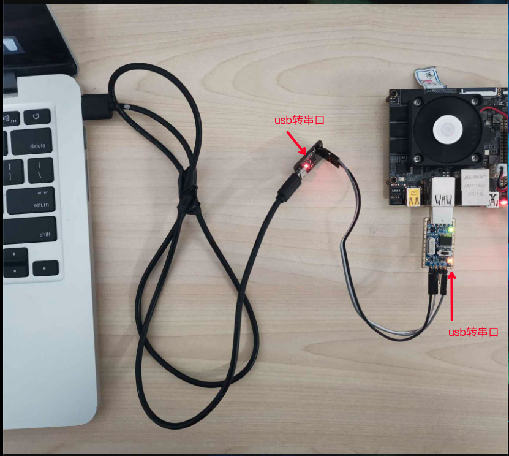
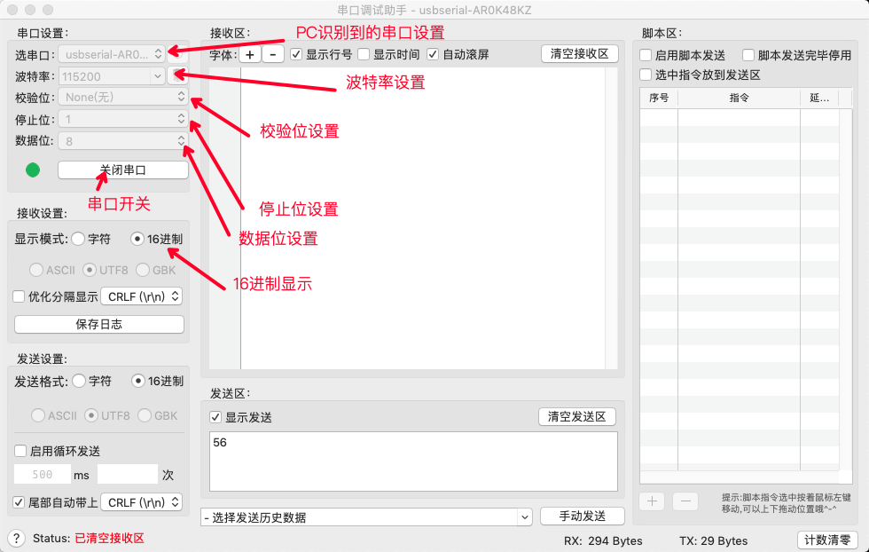
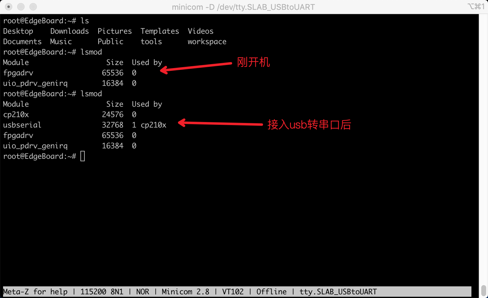
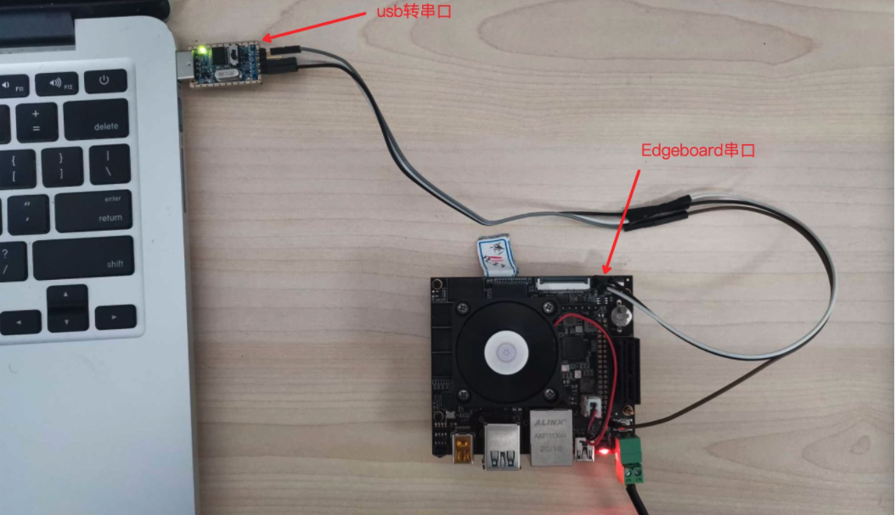
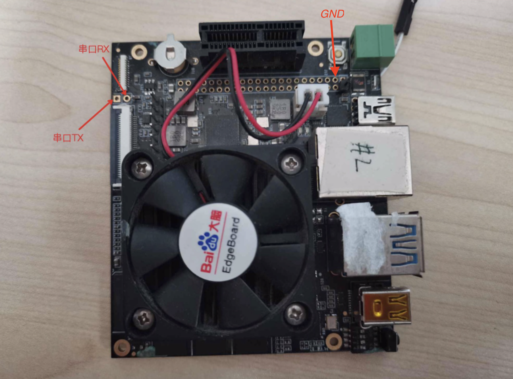

# SmartCarToolKits

将SmartCarToolKits工程放到/root/workspace/下


串口或者网口进入Edgeboard中linux系统。（具体详见`FZ3B可视化访问的方法说明`手册）

## c++

### camera2video

#### 依赖的源文件

`SmartCarToolKits/c++/demo`中：`camera2video.cpp`

#### 功能介绍：

将摄像头实时采集到的结果，转换成灰度视频。通过ctrl+c暂停。程序执行时间不宜过长。

#### 准备工作：

将摄像头插入EdgeBoard中。

#### 编译方法：

```sh
cd /root/workspace/SmartCarToolKits/c++
mkdir build
cd build
cmake .. 
make camera2video -j
```

会在`build`目录下产生一个`camera2video`的应用程序

#### 使用方式：

在build目录下执行 `./camera2video`

```sh
./camera2video 
```

#### 产生效果：

会在`build`目录下得到一个灰度的`camera.avi`视频文件。


### camera_display

#### 依赖的源文件

`SmartCarToolKits/c++/demo`中的`camera_display.cpp`

#### 功能介绍：

实时显示，外接显示器直接显示或者通过vnc显示

#### 准备工作：

连接好网口。

将摄像头插入`EdgeBoard`上的`USB`口中。

连接好显示器，或者通过vnc显示（具体详见`FZ3B可视化访问的方法说明`手册）


#### 编译方法：

```sh
cd /root/workspace/SmartCarToolKits/c++
mkdir build
cd build
cmake .. 
make camera_display -j
```

会在`build`目录下产生一个`camera_display`的应用程序

#### 使用方式：

在`build`目录下执行 ：

```sh
./camera_display
```

#### 产生效果：

可以在`VNC`或者显示器中，看到一个名为`usbcamera`的视频框。


### rgb_mat2gray_array

#### 依赖的源文件：

`SmartCarToolKits/c++/demo`中：`rgb_mat2gray_array.cpp`

#### 功能介绍：

将一张`RGB`图转换成灰度图

#### 准备工作：

将准备要转换的图片文件夹放到`/root/workspace/`路径下，以命名为`train`为例（可任意命名）。

假设`train`中的图片以0.jpg，1.jpg，2.jpg ...等格式递增。

#### 编译方法：

```sh
cd /root/workspace/SmartCarToolKits/c++
mkdir build
cd build
cmake .. 
make rgb_mat2gray_array -j
```

会在`build`目录下产生一个`rgb_mat2gray_array`的应用程序

#### 使用方式：

在`build`目录下执行 `./rgb_mat2gray_array 图片的路径`

```sh
./rgb_mat2gray_array /root/workspace/train/0.jpg
```

#### 产生效果：

会在`build`目录下得到`0.jpg`灰度的文件，命名为`gray.jpg`


### predict

#### 依赖的源文件：

`SmartCarToolKits/c++/demo`中：`predict.cpp`

#### 功能介绍：

查看训练的模型识别情况。

#### 准备工作：

将想要识别的地标放到赛道。

将小车放到赛道上，

连接好网口

将摄像头插入`EdgeBoard`上的`USB`口中。

连接好显示器，打开VNC。（具体详见`FZ3B可视化访问的方法说明`手册）

将准备含有模型的文件夹放到`/root/workspace/`路径下，以命名为`mobilenet-ssd`为例（可任意命名）。

#### 模型文件夹：

以`mobilenet-ssd`为例，包含四个文件

`config.json`、`label_list.txt`、`mobilenet_v2_ssd-model`、`mobilenet_v2_ssd-params`

`config.json`中内容：

```sh
{	
	"model_file_name":"mobilenet_v2_ssd-model",
	"params_file_name":"mobilenet_v2_ssd-params",

	"labels_file_name":"label_list.txt",

	"format":"RGB",
	"input_width":300,
	"input_height":300,
		
	"mean":[127.5,127.5,127.5],
    "scale":[0.007843,0.007843,0.007843],
	"threshold":0.5
}
```

**参数说明：**

`model_file_name`：指定模型文件的名字

`params_file_name`：指定模型参数文件的名字

`labels_file_name`：指定标签文件的名字


`label_list.txt`中内容：

```sh
background
Exit Two
Exit One
Pedestrian
Safety Cone
Gas Station
Prohibitory
Flooded Area
```

按照顺序排列训练的模型标签名字。

#### 编译方法：

```sh
cd /root/workspace/SmartCarToolKits/c++
mkdir build
cd build
cmake .. 
make predict -j
```

会在`build`目录下产生一个`predict`的应用程序

#### 使用方式：

在`build`目录下执行 `./predict 模型所在文件夹的路径`

```sh
./predict /root/workspace/SmartCarToolKits/mobilenet-ssd/
```

#### 产生效果：

在`VNC`或者显示器中查看自己训练的模型的识别情况。


### 串口通信

`EdgeBoard`支持两种串口通信：`USB`转`UART`和`UART`，下面分别描述两种使用方法。

#### USB转UART

##### 依赖的源文件

`usb_uart_send.cpp`

`usb_uart_recv.cpp`

##### 功能介绍

`usb_uart_send`：`EdgeBoard`通过`usb`转串口，循环1s发送`00-09`的数据

`usb_uart_recv`：`EdgeBoard`通过`usb`转串口，超时接收一个字节的数据

##### 准备工作

1. 软件：将`SmartCarToolKits`工程放到板子上的`/root/workspace/`文件夹下。
2. 硬件：三根杜邦线(`TX`，`RX`，`GND`)、2个`USB`转串口工具、`PC`电脑上安装串口调试助手。



串口协议规定为下图交叉相连方式。


注意：有的`USB`转串口的`TX`与`RX`标识是转换后的，不需要交叉。

##### 编译方式

```sh
cd /root/workspace/SmartCarToolKits/c++
mkdir build
cd build
cmake .. 
make usb_uart_send -j
make usb_uart_recv -j
```

##### 使用方式

1. 按照准备工作中的连接示意图连接并且保证 电脑安装了对应的`USB`转串口驱动。
2. 打开电脑上的串口调试助手，选择串口号，并在串口调试助手中设置:波特率为115200，8位数据位，无校验位。



3. 发送实验：`EdgeBoard`发送，电脑接收

   `EdgeBoard`:执行`./usb_uart_send`程序

   电脑串口调试助手：查看接收结果，接收区会显示`EdgeBoard`发过来的数据，十六进制显示为`00-09`。

   

4. 接收实验：`EdgeBoard`接收，电脑发送

   电脑串口调试助手：发送十六进制数据。以`0x56`为例

   `EdgeBoard`:执行`./usb_uart_recv`程序，显示如下结果


##### 问题排查方法

`EdgeBoard` 目前支持的`USB`转串口的 控制器芯片：  `CH341` 和 `CP210x`

1. 查看硬件是否连接良好。

2.  `lsusb` 查看是否有新设备 :证明 `USB`设备已经被识别了。


3. 执行 `lsmod` 命令，查看驱动是否被加载：



4. 查看`USB`转串口的设备节点：`ls` `/dev/tty.USB*`  


#### UART

##### 依赖的源文件

`uart_send.cpp`

`uart_recv.cpp`

##### 功能介绍

主要有`uart_send`、`uart_recv`应用程序

`uart_send`：`EdgeBoard`通过串口，循环1s发送`00-09`的数据

`uart_recv`：`EdgeBoard`通过串口，超时接收接收一个字节的数据

##### 准备工作

1. 软件：软件：将`SmartCarToolKits`工程放到板子上的`/root/workspace/`文件夹下。

2. 硬件：三根杜邦线（`TX`，`RX`，`GND`）、1个`USB`转串口工具、电脑上安装串口调试助手




注意：有的`USB`转串口的`TX`与`RX`标识是转换后的，不需要交叉。



##### 编译方式

```sh
cd /root/workspace/SmartCarToolKits/c++
mkdir build
cd build
cmake .. 
make uart_send -j
make uart_recv -j
```

##### 使用方式

同`USB`转`UART`章节

##### 问题排查的方法

1. 查看硬件是否连接良好。

2. 串口`TX`、`RX`是否反接

3. 查看设备节点是否存在：`ls /dev/ttyPS1`

## python

进入到`SmartCarToolKits/python`文件夹中，python相关功能属于非必须功能，用户选择性参考即可

```
cd /root/workspace/SmartCarToolKits/python/
```

### capture.py

#### 功能介绍：

通过摄像头抓取图片并保存到执行目录下

#### 准备工作：

将摄像头插入到`Edgeboard`上的`USB`口中

#### 使用方式：

```sh
cd /root/workspace/SmartCarToolKits/python/
python3  capture.py
```

#### 产生效果：

在`python`文件夹当中生成一个`0.jpg`的文件，此文件为当前摄像头采集的图片。


### collect.py

#### 功能介绍：

测试手柄驱动：

#### 准备工作：

将摄像头插入到`Edgeboard`上的`USB`口中。

将手柄插入到`Edgeboard`上的`USB`口中。

由于`Edgeboard`资源限制。需要用到`USB`扩展口。将`USB`扩展口插入到`Edgeboard`上。摄像头与手柄在扩展口上插上即可。

关于适配的`USB`扩展口与摄像头详见`图像采集与WiFi使用说明`

#### 使用方式

执行此程序前先将小车架起来，因为执行此程序，小车会动起来。

```sh
cd /root/workspace/SmartCarToolKits/python/
python3  collect.py
```

双手抓住手柄。

点击右手食指部位的RB键。小车后轮会动起来。

晃动左手侧摇杆，小车前轮左右方向会跟随摇杆左右方向晃动而切换。

前侧左手食指部位的LB键。小车停止运动。

#### 产生效果：

会在当前文件夹生成一个`train`文件夹。

`train`文件夹中包含，执行`python3 collect.py`后采集的图片序列，以及一个json文件。


